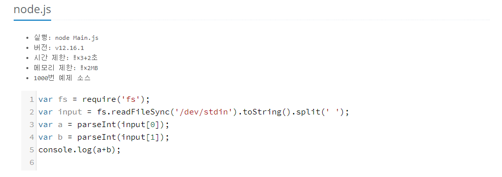
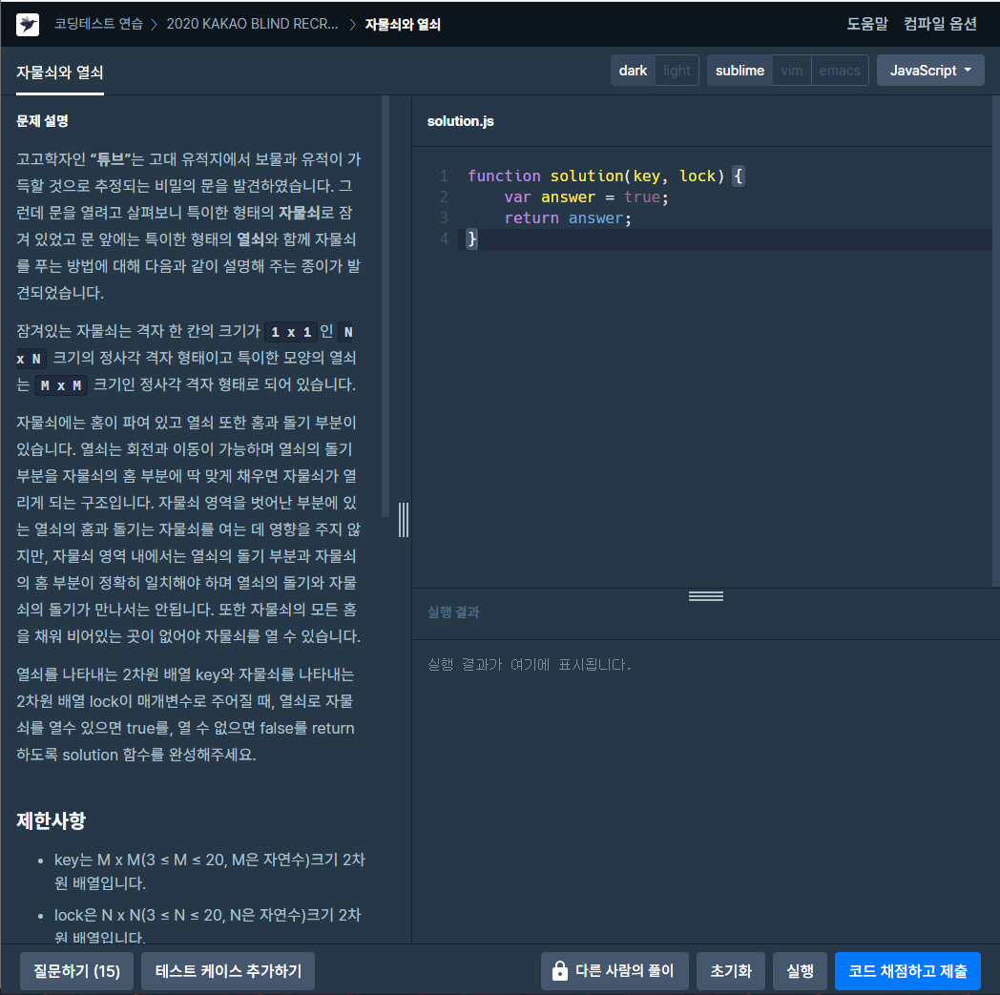

# 입력과 출력

- 입출력 방식은 플랫폼 별로 다를 수 있으며, 각 플랫폼에서 제시하는 방식을 이용하면 된다.
- 대표적인 입출력 예
  - 백준 온라인저지(파일 입출력, console.log)

  <https://www.acmicpc.net/help/language>

  

  ```javascript
  var fs = require('fs');
  var input = fs.readFileSync('/dev/stdin').toString().split(' ');
  var a = parseInt(input[0]);
  var b = parseInt(input[1]);
  console.log(a+b);
  ```

  ------------------------------------------------------------

  - Programmers(함수 입출력)

  
  
  ```javascript
  function solution(inputs) {
      return output
  }
  ```
