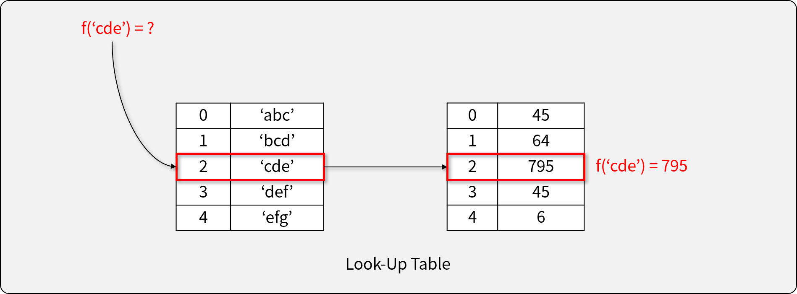
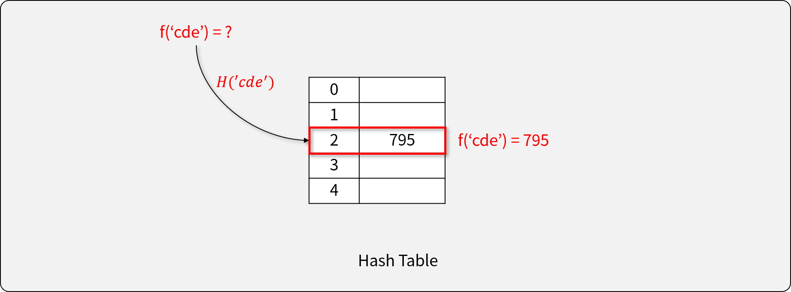

# 위장

## 문제 설명

스파이들은 매일 다른 옷을 조합하여 입어 자신을 위장합니다.

예를 들어 스파이가 가진 옷이 아래와 같고 오늘 스파이가 동그란 안경, 긴 코트, 파란색 티셔츠를 입었다면 다음날은 청바지를 추가로 입거나 동그란 안경 대신 검정 선글라스를 착용하거나 해야 합니다.

|종류| 이름 |
|---|-------|
|얼굴| 동그란 안경, 검정 선글라스|
|상의| 파란색 티셔츠|
|하의| 청바지|
|겉옷| 긴 코트|

스파이가 가진 의상들이 담긴 2차원 배열 clothes가 주어질 때 서로 다른 옷의 조합의 수를 return 하도록 solution 함수를 작성해주세요.

### 제한 사항

- clothes의 각 행은 [의상의 이름, 의상의 종류]로 이루어져 있습니다.
- 스파이가 가진 의상의 수는 1개 이상 30개 이하입니다.
- 같은 이름을 가진 의상은 존재하지 않습니다.
- clothes의 모든 원소는 문자열로 이루어져 있습니다.
- 모든 문자열의 길이는 1 이상 20 이하인 자연수이고 알파벳 소문자 또는 '_' 로만 이루어져 있습니다.
- 스파이는 하루에 최소 한 개의 의상은 입습니다.

### 입출력 예

|clothes| return|
|-------|-------|
| `[['yellow_hat', 'headgear'], ['blue_sunglasses', 'eyewear'], ['green_turban', 'headgear']]` | 5 |
| `[['crow_mask','face'], ['blue_sunglasses', 'face'], ['smoky_makeup', 'face']]` | 3 |

### 입출력 예에 대한 설명

- 입출력 예 #1

headgear에 해당하는 의상이 yellow_hat, green_turban이고 eyewear에 해당하는 의상이 blue_sunglasses이므로 아래와 같이 5개의 조합이 가능합니다.

```
1. yellow_hat
2. blue_sunglasses
3. green_turban
4. yellow_hat + blue_sunglasses
5. green_turban + blue_sunglasses
```

- 입출력 예 #2

face에 해당하는 의상이 crow_mask, blue_sunglasses, smoky_makeup이므로 아래와 같이 3개의 조합이 가능합니다.

```
1. crow_mask
2. blue_sunglasses
3. smoky_makeup
```

### 참조 코드

- [기반 소스 코드](src/before.js)
- [솔루션 코드](src/after.js)

-------

## 문제 풀이

### 접근 방법

- 문자열로 주어진 자료를 정리하는 방법을 찾는다.
  - Look-Up Table(LUT)을 이용하는 방법
  - Hash Table을 이용하는 방법 (Map Object)
- 모든 조합의 경우의 수를 계산할 수 있다.

### Look-Up Table을 이용하는 경우



- Index -> Key로 접근하는 자료 구조
- 정확히 필요한 메모리만 사용하지만, LUT를 검색하는 Overhead가 있다.

```javascript
const lut = ['a', 'b', 'c'];
const array = [5, 6, 7];

console.log(array[lut.indexOf('a')]); // 5
```

### Hash Table을 이용하는 경우



- Key - Value의 자료 쌍을 저장하는 자료 구조
  - Key와 Value는 모든 Object가 될 수 있다.
- Key로부터 Hash Function을 이용해 곧바로 Value에 접근할 수 있다.
- JavaScript에서는 Map 오브젝트로 구현되어 있다.
  - `set`, `has`, `get` method를 이용하여 필요한 기능 구현 가능

```javascript
const map = new Map();
map.set('a', 5);
map.set('b', 6);
map.set('c', 7);

console.log(map.get('a'));  // 5

map.has('a'); // true
map.has('d'); // false
```

## 문제 출처

<https://programmers.co.kr/learn/courses/30/lessons/42578>
