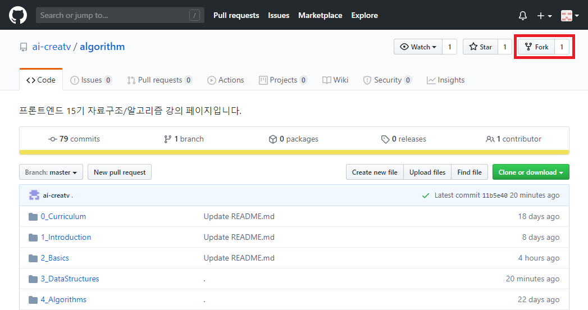

# Homework #3

## Queue의 구현

### Circular Queue 구현

- [Reference 페이지](https://github.com/ai-creatv/algorithm/tree/master/3_DataStructures/3_6_Queues)
- [Source Code](https://github.com/ai-creatv/algorithm/blob/master/3_DataStructures/3_6_Queues/src/circularQ/after.js)를 기반으로 코드 작성
- 구현한 자료구조를 테스트하는 코드도 직접 작성하여 테스트 수행

### Linked Queue 구현

- [Reference 페이지](https://github.com/ai-creatv/algorithm/tree/master/3_DataStructures/3_6_Queues)
- [Source Code](https://github.com/ai-creatv/algorithm/blob/master/3_DataStructures/3_6_Queues/src/linkedQ/after.js)를 기반으로 코드 작성
- 구현한 자료구조를 테스트하는 코드도 직접 작성하여 테스트 수행

## 제출 사항

- **Circular, Linked Queue 자료구조의 구현된 소스 코드**
  - **자료 구조의 `after.js` 파일**

## 제출 기한 및 방법

- **GitHub을 통해 제출**
  1. 강의 Github Repository(<https://github.com/ai-creatv/algorithm>)를 Fork
  
  1. 이미 Fork한 경우에는 [참조 페이지](https://help.github.com/en/github/collaborating-with-issues-and-pull-requests/syncing-a-fork)를 참고하여 Repository를 Sync한 후에 작업 진행
  1. Fork하여 생성된 본인의 Repository에 구현 완료된 소스 코드를 Push하여 제출
- **Push 완료 후, <ai@creatv.kr>으로 Fork한 본인의 Repository의 주소를 제출**
- **6월 21일(일) 자정**까지 제출
