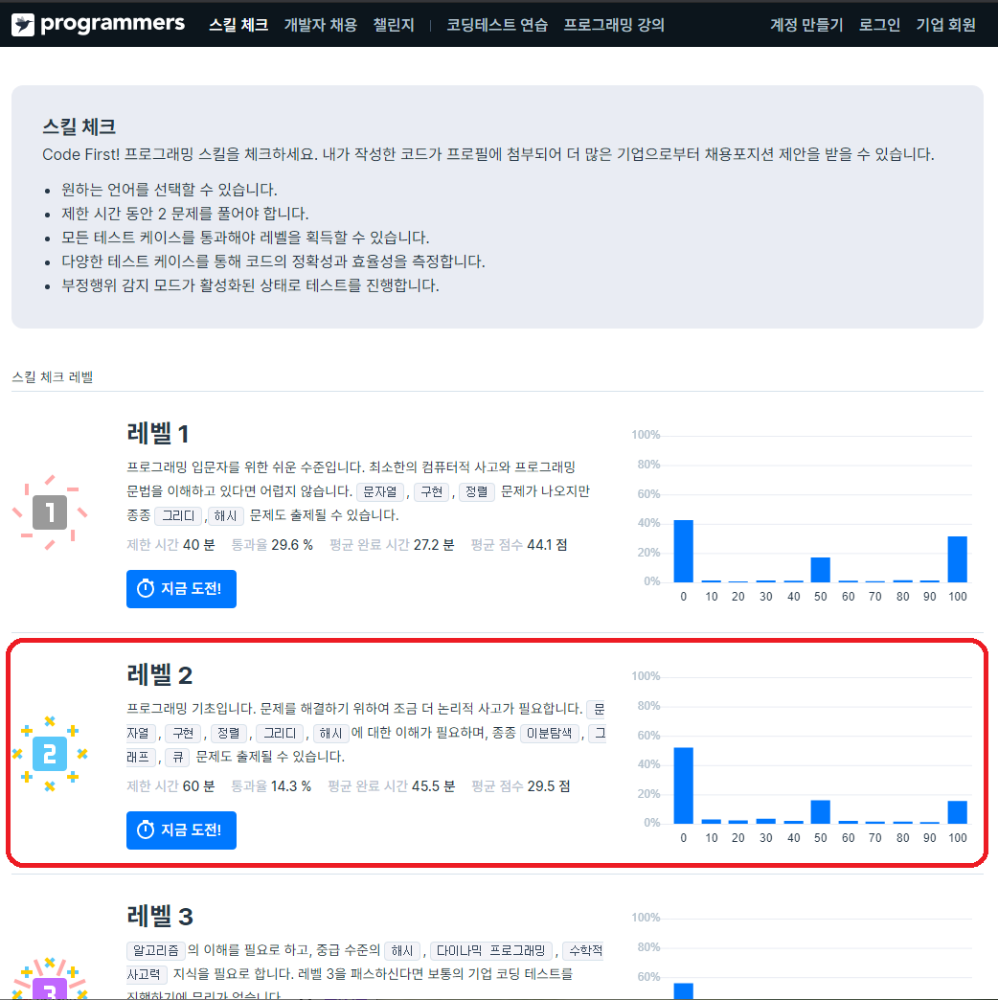

# Homework #1

## Programmers Level2 획득

<https://programmers.co.kr/skill_checks>

## Level2 획득 요령

- [JavaScript 레퍼런스](https://devdocs.programmers.co.kr/javascript/)를 참조하여 문제 해결

## 제출 사항

- **Skill Check 레벨2 획득 스크린샷**
- **알고리즘 테스트 과정에 작성한 소스코드**

## 제출 기한 및 방법

- <ai@creatv.kr>으로 하나의 파일로 압축하여 제출
- **6월 28일(일) 자정**까지 제출
